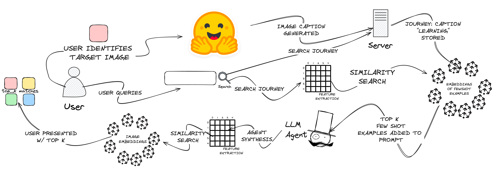
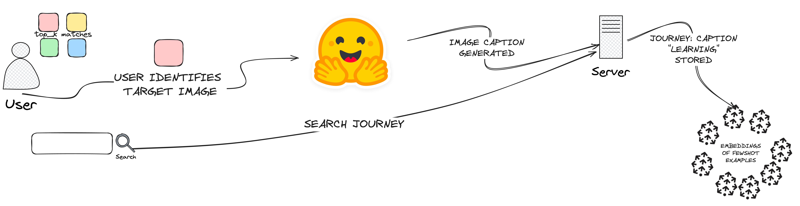
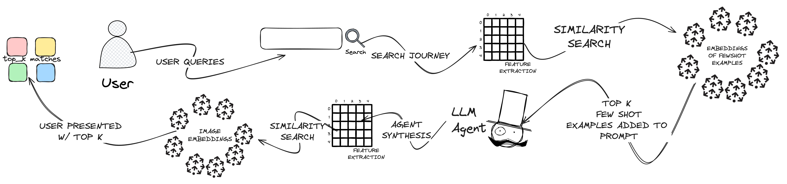

## Abstract
In this paper, we present a preliminary implementation of Storylines,
a prototype cross-modal image text retrieval (ITR) system that 
leverages vector databases and the in-context learning capabilities of 
large language models (LLMs) to learn the semantics of its users in real time. 
Storylines implements existing techniques found in ITR research.
Furthermore, it augments these techniques, further reducing the semantic gap,
by applying additional labeling data inferred from the user's search journeys 
while using the tool.
We describe its implementation details and how we plan to demonstrate its performance during the conference demo session.
## Introduction
Most modern photo library applications come equipped with search capabilities,
enabling users to locate images based on text descriptions.
Underlying these search capabilities are technologies that impelement the 
text-to-image retrieval subtask of cross-modal image-text retrieval (ITR). 

The first and most crucial process in an ITR system is the
feature extraction process, wherein vector representations (embeddings) of images
and text are generated [image-text retrieval survey]. There are various approaches
to feature extraction, Visual Semantic Embedding (VSE), Cross-Attention (CA) and 
Self-Adaptive (SA) to name a few. [image-text retrieval survey] In each approach
a universal cross-modal model is pretrained on a large dataset of images and text
and used downstream to generate embeddings for the ITR task.

In photo library applications, the text-to-image retrieval implementation usually
consists of two components: a vector store populated with image embeddings from
the feature extraction process and a query engine. When a user submits a query,
the query engine embeds the query to the same vector space and utilizes a 
similarity search algorithm to rank the images in the vector store.
It follows then that the quality of search results is dependent on the 
similarity of the query to the images in the vector store.

Due to the one size fits all nature of the underlying embedding models, 
current photo library systems often require generalized queries from users.
Additionally, in fulfilling user queries, current photo library systems take a
single try approach, yielding abundant results or none at all (in which case, the user is asked to try again).

Our work aims to circumvent the limitations surrounding the one size fits all
nature of the models that necessitate generalized queries and the single try approach
that forces users to try again. 
We build upon traditional text-to-image retrieval techniques with user interface 
elements that re-prompt users for additional information when initial queries 
are insufficient. In doing so, we are able to iteratively refine a user's query,
giving them the opportunity to provide additional more generalized information 
to supplement their initial more semantic query.
We call the string of queries a user supplies to find a photo a 'search journey'.

To further reduce the semantic gap between a user's understanding 
of the photos in their library and the learned world view of a universal cross-modal model,
we derive from every search journey additional data 
that is provided as few shot examples to an LLM agent that is
added to the query engine. Few shot prompting is a technique for enabling the
in-context learning capabilities of LLMs proposed by Brown et al. [GPT-3] where
we provide demonstrations in the LLMs prompt to steer the model
to better performance. [few shot website]
Consequently, the system becomes increasingly capable of 
understanding the nuances of the user’s semantics over time, providing a more
personalized and effective search user experience.

This demo paper presents a preliminary implementation we call Storylines, a prototype
web application that implements the aforementioned techniques. We describe its
implementation details and how we plan to demonstrate its performance during the
conference demo session.

## IMPLEMENTATION DETAILS

*Figure 1: Storylines full system architecture*
The presented prototype web application was impelemented using the Streamlit Python library.
Given the nature of the improvements we are striving for i.e learning the nuances 
of a user's semantic understanding of photos, searching against a personalized 
collection of photos  is advantageous. We Integration with the Google 
Photos API helps provide us the access to a personal media collection that serves as the 
object of our search.

The baseline text-to-image retreival model used is trained using the 
Contrastive Learning Image Pre-training aproach proposed by Radford et al. [CLIP], 
More sepecifcally, we use the ViT-B/32 model trained by Reimers et al. [sent-transfomers].
When the user authenticates with their Google account, the application retrieves
the user's photo library and generates embeddings for each photo using the CLIP model.
These embeddings are stored in a pinecone vector store for later retrieval.

Our approach differs from traditional text-to-image retrieval systems in it's 
design of the query engine. Specifically, the building of a
search journey to iteratively refine a user's query and the integration of an LLM
agent to synthesize the journey into the generalized query that is used to retrieve
images from the vector store.
The building of a search journey is implemented as a variation to the search 
flow of traditional text-to-image retrieval systems. While the user is presented
with top results from their initial query, they are also presented with a blank
search bar for additional queries as well as a list of the queries they have inputted
thus far. From this point, the user can submit additional queries, identify the target
image from the presented options or begin a new search journey.

Every time a user submits a new query to their journey, the system goes through a
search process to retrieve the top results to present to the user. 

*Figure 2: Summary of learning process: The user identifies the target image 
from the presented options. The system generates a caption for the target 
image using the BLIP model. The system stores a mapping of the search journey 
to the generated caption.*

To explain the search process, we must first describe the learning process.
As mentioned in the introduction, we leverage the in-conext learning capabilities of LLMs.
We do this by storing mappings of search journeys to captions of the user identified
target image and provide these as few shot examples when prompting the LLM agent.
These captions are generated using the BLIP image captioning model proposed by 
Li et al. [BLIP].

The learning process can thus be summarized as follows:
1. The user identifies the target image from the presented options
2. The system generates a caption for the target image using the BLIP model
3. The system stores a mapping of the search journey to the generated caption

*Figure 3: Summary of the search process: The users search journey is first searched
against a vector store of learned examples. The top results, along with the search
journey are fed to an LLM agent that generates a generalized query. The generalized
query is then used to search against the vector store of image embeddings.*

For the actual search process, we utilize two vector stores. The first is the vector
store of image embeddings generated from the CLIP model. The second is a vector store
holding embeddings of the aforementioned mapping. Both these vector stores are hosted
on pinecone. 

The search process can thus be summarized as follows (Figure 1):
1. The user submits a query to their search journey
2. The system retrieves the top results from the vector store of mappings
3. The system prompts the LLM agent with the search journey, providing the top results from
the mappings vector store as few shot examples
4. The LLM agent generates a generalized query
5. The system retrieves the top results from the vector store of image embeddings
using the generalized query

## DEMO

*Figure 4: Storylines demo interface*
The demo interface is a web application hosted on the Streamlit community sharing platform.
And reachable at https://storylines.streamlit.app. The demo interface is divided into
three sections: A page for the user to authenticate with their Google account, a page for
the user to upsert photos from their library into the tool for searching and a page that
showcases the search capabilities of the tool.

## CONCLUSION
In this demo paper, we presented a preliminary implementation of Storylines, a prototype
cross-modal image text retrieval (ITR) system that leverages vector databases and the
in-context learning capabilities of large language models (LLMs) to adapt to 
its users in real time. Storylines builds on existing techniques found in ITR research
using ui elements that allow the user to iteratively refine their query and LLM agent
that synthesizes these iterations. Storylines also uses this LLM agent to learn the
nuances of the user's semantics by storing few shot examples generated from the 
user's search journeys while using the tool.
We described its implementation details and how we plan to demonstrate its performance
during the conference demo session.
